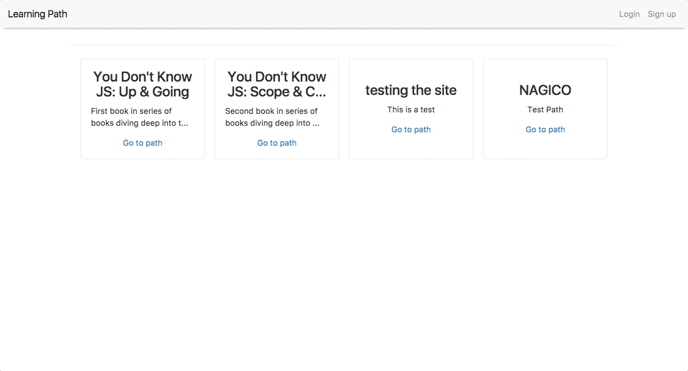

# Learning Path

This app allows people to create learning paths, mark their progress and see who else is working through the same learning path.



## Stack

- [React](https://facebook.github.io/react/)
- [Redux](http://redux.js.org/)
- [React Router](https://reacttraining.com/react-router/)
- [Node](https://nodejs.org/en/)
- [Express](https://expressjs.com/)
- [Graphql](http://graphql.org/)

## Dependencies

### MongoDB
You need mongodb running on your local machine on port 27017 (the default).  
Go to https://docs.mongodb.com/manual/installation/ for instructions.  
If you want to change this just go to server/src/config.js  

## Installation

### Server:  

from a terminal in the root folder execute  

```
cd server
npm install
```

to run the server in development mode execute from the 'server' folder  

```
npm start
```

the server will run on http://localhost:8080  

### Client:  

from a terminal in the root folder execute  

```
cd client
npm install
```

to run the client in development mode execute from the 'client' folder  

```
npm start
```  

the client will run on http://localhost:3000  
